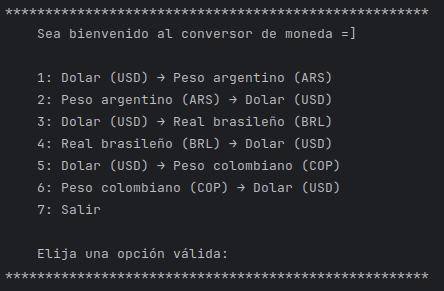

# CONVERSOR DE MONEDAS

Este proyecto es un conversor de divisas que permite convertir entre varias monedas seleccionadas dinámicamente. Utiliza una API externa para obtener tasas de conversión actualizadas. Fue desarrollado como parte de un proyecto de Alura Latam y Oracle para mejorar las habilidades en Java y trabajar con APIs REST.

## Características

- Convierte entre varias monedas de manera dinámica.
- Calcula conversiones de acuerdo con las tasas actuales obtenidas de la API de ExchangeRate.
- Ofrece un menú interactivo para seleccionar las monedas y la cantidad a convertir.
- Incluye soporte para las siguientes conversiones:
  - Dólar estadounidense (USD) ↔ Peso argentino (ARS)
  - Dólar estadounidense (USD) ↔ Real brasileño (BRL)
  - Dólar estadounidense (USD) ↔ Peso colombiano (COP)

## Tecnologías Utilizadas

- Lenguaje de programación: Java
- Librerías utilizadas:
  - Gson para la manipulación de JSON.
  - HttpClient para realizar las solicitudes HTTP.
  - ExchangeRate-API para obtener las tasas de conversión en tiempo real.

# Uso

1. Clona el repositorio.
2. Asegúrate de tener configurado tu entorno de Java (JDK 11 o superior).
3. Ejecuta el archivo principal ConversorApp.java.
4. Selecciona la opción deseada desde el menú interactivo.
5. Introduce la cantidad a convertir y visualiza el resultado.

## Autor

- Juan Valenzuela
- https://github.com/Juan-Valenzuela3
- https://www.linkedin.com/in/juan-valenzuela-camelo

## Licencia

- Este proyecto está licenciado bajo la [Licencia MIT](./LICENSE).

